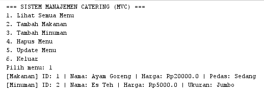
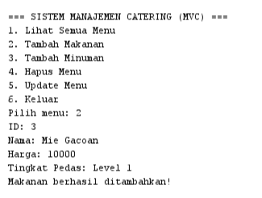
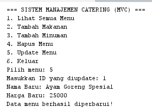
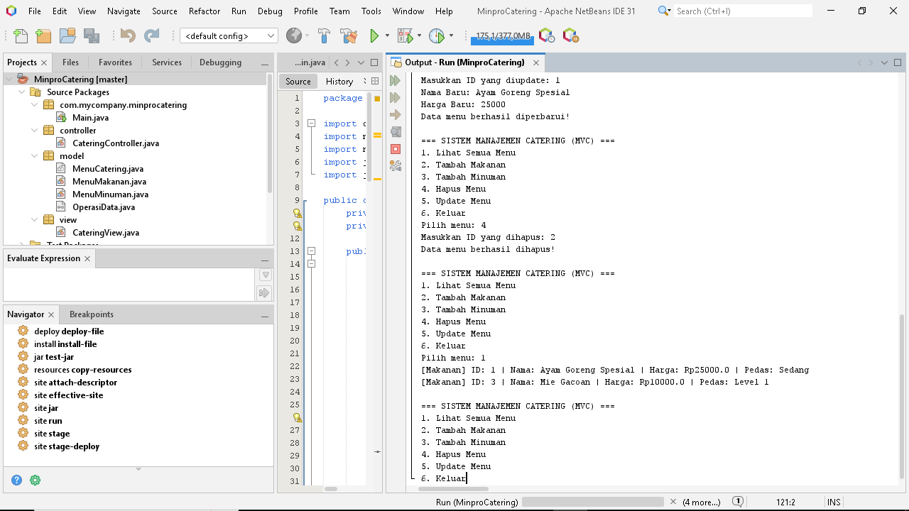

# Minpro-3-PBO-Catering

Aplikasi ini merupakan pengembangan dari Mini Project 2 untuk memenuhi tugas akhir Mini Project 3 pada praktikum Pemrograman Berorientasi Objek (PBO). Program ini dikembangkan menggunakan bahasa pemrograman Java untuk mengelola sistem manajemen menu catering harian berbasis konsol dengan menerapkan arsitektur Model-View-Controller (MVC) serta penanganan validasi input yang aman.

---

## 📌 Deskripsi Program
Aplikasi ini dirancang untuk mencatat, menampilkan, memperbarui, dan menghapus data menu catering yang terbagi menjadi dua kategori utama: **Makanan** (dengan atribut tingkat pedas) dan **Minuman** (dengan atribut ukuran). Seluruh data disimpan secara dinamis di dalam `ArrayList` dan mendukung operasi CRUD (Create, Read, Update, Delete) secara penuh. Program ini juga dilengkapi dengan mekanisme *error handling* (`try-catch`) untuk mencegah aplikasi *crash* saat pengguna salah memasukkan tipe data.

---

## 📁 Penjelasan Struktur Package
Proyek ini disusun rapi menggunakan arsitektur MVC yang terbagi ke dalam beberapa package:
- `model`: Berisi kelas *abstract* `MenuCatering`, kelas anak (`MenuMakanan` dan `MenuMinuman`), serta interface `OperasiData`.
- `controller`: Berisi kelas `CateringController` yang menangani logika bisnis, mengelola `ArrayList`, dan mengimplementasikan interface `OperasiData`.
- `view`: Berisi kelas `CateringView` yang mengatur antarmuka konsol, menerima input interaktif dari pengguna, dan menyediakan penanganan validasi input.
- `com.mycompany.minprocatering`: Berisi kelas `Main` yang berfungsi sebagai titik awal (*entry point*) untuk menjalankan seluruh aplikasi.

---

## 🔄 Penjelasan Detail Alur Program
1. **Inisialisasi & Data Awal**:
   Program dijalankan dari `Main.java` yang memanggil metode `start()` pada `CateringView`. Saat `CateringController` diinisialisasi, beberapa data contoh (*dummy data*) otomatis dimasukkan ke dalam `ArrayList`.
2. **Tampilan Menu Utama & Validasi Input**:
   Program menampilkan 6 pilihan navigasi utama dalam perulangan `while`. Input angka divalidasi menggunakan metode `ambilInputAngka()` dengan blok `try-catch` (`InputMismatchException`) agar program tetap berjalan lancar saat pengguna menginputkan teks/karakter non-angka.
3. **Proses Menampilkan Data (Read)**:
   Pengguna memilih angka `1`. `CateringView` memanggil method `tampilkanSemuaMenu()` pada controller untuk mencetak seluruh detail menu makanan dan minuman.
4. **Proses Input Data (Create)**:
   Pengguna memilih angka `2` (Tambah Makanan) atau `3` (Tambah Minuman). Program meminta input atribut terkait, membuat objek baru (`MenuMakanan` atau `MenuMinuman`), lalu menyimpannya ke `ArrayList` via method `tambahData()`.
5. **Proses Penghapusan Data (Delete)**:
   Pengguna memilih angka `4` dan memasukkan ID menu yang dicari. Controller mencari ID tersebut dan menghapusnya dari `ArrayList` via method `hapusData()`.
6. **Proses Pembaruan Data (Update)**:
   Pengguna memilih angka `5`, memasukkan ID target, lalu menginput nama dan harga baru. Controller memperbarui atribut objek tersebut via method `updateData()`.
7. **Keluar**:
   Pengguna memilih angka `6` untuk menutup aplikasi secara aman.

---

## 🛡️ Penjelasan Penerapan Encapsulation dan Inheritance
- **Encapsulation**:
  Seluruh atribut pada kelas dasar (`id`, `nama`, `harga`) dideklarasikan dengan kata kunci `private`. Akses dan modifikasi atribut dilakukan secara aman melalui metode *getter* (`getId()`, `getNama()`, `getHarga()`) dan *setter* (`setNama()`, `setHarga()`).
- **Inheritance**:
  - **Superclass**: `MenuCatering` sebagai kelas induk *abstract*.
  - **Subclass**: `MenuMakanan` (menambahkan variabel `tingkatPedas`) dan `MenuMinuman` (menambahkan variabel `ukuran`) mewarisi atribut dan metode dari `MenuCatering` menggunakan kata kunci `extends`.

---

## ⚡ Penjelasan Penerapan Polymorphism dan Abstraction
- **Abstraction**:
  `MenuCatering` dideklarasikan sebagai `abstract class` sehingga tidak dapat diinstansiasi secara langsung. Kelas ini memiliki *abstract method* `tampilDetail()` yang wajib diimplementasikan ulang oleh kelas anak.
- **Polymorphism**:
  - **Overriding**: Method `tampilDetail()` di-*override* pada kelas `MenuMakanan` dan `MenuMinuman` untuk mencetak format tampilan yang spesifik sesuai jenis menu.
  - **Overloading**: Diterapkan pada method `updateHarga()` di kelas `MenuCatering` yang memiliki dua versi parameter berbeda, yaitu `updateHarga(double hargaBaru)` dan `updateHarga(double hargaBaru, double diskon)`.

---

## 💎 Penjelasan Letak Penerapan Nilai Tambah (Interface)
- **Penerapan Interface**: Interface `OperasiData` dibuat pada package `model` untuk menetapkan standar kontrak metode operasi data (`tambahData`, `hapusData`, `updateData`).
- **Letak Implements**: Interface ini diimplementasikan secara langsung oleh kelas `CateringController` pada package `controller` (`public class CateringController implements OperasiData`) yang memuat seluruh logika manipulasi data pada `ArrayList`.

---

## 📸 Tangkapan Layar (Screenshot Output)

### 1. Lihat Semua Menu

### 2. Tambah Menu

### 3. Update Menu

### 4. Hapus Menu

